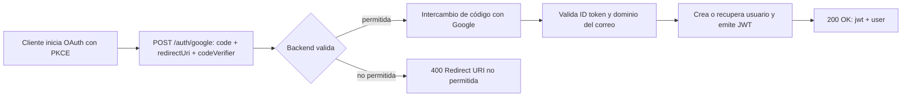

# Manual del Backend — `tsj-core`

> Manual de referencia de los contratos de la API del microservicio backend `tsj-core`. Relacionado con [[Proyecto]] y [[Tsj-Web-plan-desarollo]].

- **Tecnología:** ASP.NET Core (`.NET 10`), EF Core, Redis, JWT y auth por cookie.
- **Base de ruta global:** `/tsj-api` (config `ApiSettings:BaseRoute`).
  - Producción: `https://tecmm.mx/tsj-api`
  - Local: `http://localhost:<puerto>/tsj-api`
- **Formato de intercambio:** `application/json` (respuestas camelCase).
  - Solicitudes con cuerpo → cabecera `Content-Type: application/json`.
  - Respuestas correctas → JSON del recurso (`application/json`).
  - Respuestas de error → `application/problem+json` (ver [[#Errores]]).

---

## Autenticación y autorización

### Roles

| Rol             | Descripción                           | Cadena de herencia                                |
| --------------- | ------------------------------------- | ------------------------------------------------- |
| `Public`        | Visitante anónimo (cookie)            | `Public`                                          |
| `CampusManager` | Administrador de una unidad académica | `CampusManager` → `Public`                        |
| `Director`      | Dirección del plantel                 | `Director` → `CampusManager` → `Public`           |
| `Admin`         | Administración global                 | `Admin` → `Director` → `CampusManager` → `Public` |

> [!note] Herencia de roles
> Un rol satisface automáticamente las políticas de los roles que le siguen en la cadena (ej. `Admin` puede llamar rutas `Director`, `CampusManager` y `Public`).

### Cómo autenticarse

1. **Endpoints públicos** (`GET /unidad-academica*`): el backend asigna automáticamente una **cookie HTTP-only** (`tesj-public-user-id`) en la primera petición. No hay que enviar nada; el cliente guarda la cookie y la reenvía.
2. **Endpoints de gestión y `/auth/me`**: requieren un **JWT** en la cabecera:

```http
Authorization: Bearer <jwt>
```

### Flujo de login con Google (OAuth PKCE)



> [!tip] Detalles del flujo
> 1. El cliente inicia OAuth en Google con PKCE (`authorization code`, `redirect_uri` y `codeVerifier`).
> 2. Envía los tres valores a `POST /auth/google`.
> 3. El backend valida `redirectUri` (config `GoogleAuth:AllowedRedirectUris`), intercambia el código, valida el ID token (firma + emisor + audiencia) y el dominio del correo (`GoogleAuth:AllowedEmailDomains`, ej. `tecmm.edu.mx`).
> 4. Devuelve `200` → `{ jwt, user }`.

> [!warning] Expiración del JWT
> El JWT expira según `JwtSettings:ExpirationMinutes` (**1440 min = 1 día** por defecto). Credenciales de Google, dominios y URIs permitidas se configuran en `appsettings.json` (sección `GoogleAuth`).

---

## Índice de endpoints

| # | Método | Ruta | Autorización | Rate limit | Caché | Respuestas |
|---|--------|------|--------------|------------|-------|------------|
| 1 | `POST` | `/auth/google` | Anónimo | `auth-login` (10/300 s) | — | 200, 400, 401, 429 |
| 2 | `GET` | `/auth/me` | `GoogleUser` (JWT) | Sin rate limit | — | 200, 401 |
| 3 | `POST` | `/auth/logout` | Anónimo | Sin rate limit | — | 204 |
| 4 | `GET` | `/unidad-academica` | `Public` | `get-public` (10/60 s) | Sí · TTL 7 d | 200, 401, 429 |
| 5 | `GET` | `/unidad-academica/{id}` | `Public` | `get-public` (10/60 s) | Sí · TTL 7 d | 200, 401, 404, 429 |
| 6 | `GET` | `/unidad-academica/management` | `CampusManager` | `write` (token bucket) | No | 200, 401, 403, 429 |
| 7 | `GET` | `/unidad-academica/management/{id}` | `CampusManager` | `write` (token bucket) | No | 200, 401, 403, 404, 429 |
| 8 | `POST` | `/unidad-academica/management` | `Director` | `write` (token bucket) | No | 201, 401, 403, 422, 429 |
| 9 | `PUT` | `/unidad-academica/management/{id}` | `CampusManager` | `write` (token bucket) | No | 200, 401, 403, 404, 422, 429 |
| 10 | `PATCH` | `/unidad-academica/management/{id}` | `CampusManager` | `write` (token bucket) | No | 200, 401, 403, 404, 422, 429 |
| 11 | `POST` | `/unidad-academica/management/{id}/disable` | `CampusManager` | `write` (token bucket) | No | 200, 401, 403, 404, 429 |
| 12 | `POST` | `/unidad-academica/management/{id}/enable` | `CampusManager` | `write` (token bucket) | No | 200, 401, 403, 404, 429 |
| 13 | `DELETE` | `/unidad-academica/management/{id}` | `Admin` | `write` (token bucket) | No | 200, 401, 403, 404, 422, 429 |

> [!warning] Rate limiting por ruta
> Los valores entre paréntesis son los **aplicables a esa ruta** según la configuración actual de `appsettings.json` (sección `RateLimiting:Policies`). Son editables; el contrato es la **política**, no el número exacto.

---

## Endpoints de `UnidadAcademica`

### Recurso `UnidadAcademicaResponse`

```json
{
  "id": 3,
  "name": "Tecnológico de Estudios Superiores de Jocotitlán",
  "coverPhoto": "https://cdn.example.com/covers/jocotitlan.jpg",
  "iconPhoto": "https://cdn.example.com/icons/jocotitlan.png",
  "address": "Calle Tecnológico S/N, Jocotitlán, Estado de México",
  "phone": "712 123 4567",
  "email": "contacto@tesj.edu.mx",
  "whatsapp": "5217121234567",
  "disabled": false
}
```

### 3.1 Listar unidades académicas (público, cacheado)

`GET /tsj-api/unidad-academica`

- **Autorización:** `Public` (cookie automática).
- **Rate limit:** `get-public` — 10 peticiones / ventana de 60 s (por usuario o IP).
- **Caché:** SÍ. Clave `catalog:unidad-academica:all`, TTL **7 días**. Se invalida al escribir (crear/editar/disable/enable/eliminar).
- **Reglas:** devuelve **solo las unidades no deshabilitadas** (`disabled = false`), ordenadas por `name`.
- **Responses:** `200` (lista), `401`, `429`.

> [!info] Fail-open de caché
> Si Redis no está disponible, el catálogo público responde desde la BD (fail-open) — no se rompe la petición.

`200 OK`

```json
[
  {
    "id": 3,
    "name": "Tecnológico de Estudios Superiores de Jocotitlán",
    "coverPhoto": "https://cdn.example.com/covers/jocotitlan.jpg",
    "iconPhoto": "https://cdn.example.com/icons/jocotitlan.png",
    "address": "Calle Tecnológico S/N, Jocotitlán, Estado de México",
    "phone": "712 123 4567",
    "email": "contacto@tesj.edu.mx",
    "whatsapp": "5217121234567",
    "disabled": false
  }
]
```

### 3.2 Obtener una unidad académica (público, cacheado)

`GET /tsj-api/unidad-academica/{id}` (`id` entero)

- **Autorización:** `Public`.
- **Rate limit:** `get-public` — 10 / 60 s.
- **Caché:** SÍ. Clave `catalog:unidad-academica:id:{id}`, TTL **7 días**, invalidada al escribir.
- **Reglas:** devuelve la unidad **si `id` existe y NO está deshabilitada**; si está deshabilitada se comporta como inexistente (`404`).
- **Responses:** `200`, `401`, `404`, `429`.

`404` (cuerpo de error, `application/problem+json`)

```json
{
  "status": 404,
  "title": "Entity Not Found",
  "detail": "99: unidad académica not found or disabled",
  "instance": "/tsj-api/unidad-academica/99"
}
```

### 3.3 Listar unidades académicas (gestión, incluye deshabilitadas)

`GET /tsj-api/unidad-academica/management`

- **Autorización:** JWT con rol `CampusManager` (o superior por herencia).
- **Rate limit:** `write` — token bucket (ver [[#Rate limiting (por ruta)]]).
- **Caché:** No.
- **Reglas:** devuelve **todas** las unidades (con y sin `disabled`), ordenadas por `name`.
- **Responses:** `200`, `401`, `403`, `429`.

### 3.4 Obtener una unidad académica (gestión)

`GET /tsj-api/unidad-academica/management/{id}`

- **Autorización:** `CampusManager`+.
- **Rate limit:** `write`.
- **Caché:** No.
- **Reglas:** devuelve la unidad aunque esté deshabilitada. `404` si no existe.
- **Responses:** `200`, `401`, `403`, `404`, `429`.

### 3.5 Crear unidad académica

`POST /tsj-api/unidad-academica/management`

- **Autorización:** JWT con rol **`Director`** (o `Admin`). Requiere además permiso fino `WriteAll` (Director/Admin) → si no, `403`.
- **Rate limit:** `write`.
- **Caché:** No (pero invalida el catálogo público: `all` + `id:{id}`).
- **Cuerpo requerido:** los **7 campos**, todos obligatorios. Ver [[#Reglas de validación de campos]].
- **Responses:** `201`, `401`, `403`, `422`, `429`.

Ejemplo de objeto **correcto**:

```json
{
  "name": "Tecnológico de Estudios Superiores de Jocotitlán",
  "coverPhoto": "https://cdn.example.com/covers/jocotitlan.jpg",
  "iconPhoto": "https://cdn.example.com/icons/jocotitlan.png",
  "address": "Calle Tecnológico S/N, Jocotitlán, Estado de México",
  "phone": "712 123 4567",
  "email": "contacto@tesj.edu.mx",
  "whatsapp": "5217121234567"
}
```

`201 Created`

```json
{
  "id": 3,
  "name": "Tecnológico de Estudios Superiores de Jocotitlán",
  "coverPhoto": "https://cdn.example.com/covers/jocotitlan.jpg",
  "iconPhoto": "https://cdn.example.com/icons/jocotitlan.png",
  "address": "Calle Tecnológico S/N, Jocotitlán, Estado de México",
  "phone": "712 123 4567",
  "email": "contacto@tesj.edu.mx",
  "whatsapp": "5217121234567",
  "disabled": false
}
```

### 3.6 Reemplazar unidad académica (PUT, reemplazo total)

`PUT /tsj-api/unidad-academica/management/{id}`

- **Autorización:** `CampusManager`+. Además verifica permiso fino `CanEdit` sobre el recurso: `CampusManager` solo sobre su propia unidad (scope); Director/Admin sobre cualquier (`403` de lo contrario).
- **Rate limit:** `write`.
- **Caché:** No (invalida catálogo).
- **Cuerpo requerido:** los **7 campos**, todos obligatorios (misma especificación que el `POST`). Si se omite uno → `422`.
- **Responses:** `200`, `401`, `403`, `404`, `422`, `429`.

`200 OK` → devuelve el recurso actualizado (mismo formato de `UnidadAcademicaResponse`).

### 3.7 Editar unidad académica (PATCH, parcial)

`PATCH /tsj-api/unidad-academica/management/{id}`

- **Autorización:** `CampusManager`+ con `CanEdit` sobre el recurso.
- **Rate limit:** `write`.
- **Caché:** No (invalida catálogo).
- **Cuerpo:** cualquier combinación de campos **opcionales**, pero debe incluir **al menos un campo no nulo** (`422` si el objeto llega vacío o con todos los campos `null`).
- **Responses:** `200`, `401`, `403`, `404`, `422`, `429`.

> [!note] PATCH no puede "limpiar" campos
> Un campo enviado con valor `null` equivale a *no enviado*: no se modifica. En el estado actual del contrato no hay forma de borrar un campo vía PATCH.

Ejemplo de objeto **correcto** (solo cambia `name` y `email`):

```json
{
  "name": "Tecnológico de Estudios Superiores de Jocotitlán",
  "email": "nuevo-contacto@tesj.edu.mx"
}
```

`200 OK` → devuelve el recurso actualizado.

### 3.8 Deshabilitar unidad académica

`POST /tsj-api/unidad-academica/management/{id}/disable`

- **Autorización:** `CampusManager`+ con `CanEdit` sobre el recurso.
- **Rate limit:** `write`.
- **Caché:** No (invalida el catálogo público, de modo que deja de aparecer en los GET públicos).
- **Cuerpo:** sin cuerpo.
- **Responses:** `200`, `401`, `403`, `404`, `429`.

`200 OK` → devuelve el recurso con `"disabled": true`.

### 3.9 Habilitar unidad académica

`POST /tsj-api/unidad-academica/management/{id}/enable`

- **Autorización:** `CampusManager`+ con `CanEdit` sobre el recurso.
- **Rate limit:** `write`.
- **Caché:** No (invalida el catálogo público).
- **Cuerpo:** sin cuerpo.
- **Responses:** `200`, `401`, `403`, `404`, `429`.

`200 OK` → devuelve el recurso con `"disabled": false`.

### 3.10 Eliminar unidad académica

`DELETE /tsj-api/unidad-academica/management/{id}`

- **Autorización:** JWT con rol **`Admin`**. Requiere además permiso `DropAll` (solo Admin) → si no, `403`.
- **Rate limit:** `write`.
- **Caché:** No (invalida catálogo).
- **Cuerpo:** sin cuerpo.
- **Regla de negocio:** la unidad **no puede eliminarse** si aún tiene personal administrativo (`AdministrativeStaff`), investigadores (`Researchers`) o programas de estudio vinculados (`UnidadAcademicaStudyPrograms`) → `422`.
- **Responses:** `200`, `401`, `403`, `404`, `422`, `429`.

`200 OK` → devuelve la entidad eliminada (con su estado previo).

---

## Endpoints de `Auth`

### 4.1 Iniciar sesión con Google

`POST /tsj-api/auth/google`

- **Autorización:** anónima.
- **Rate limit:** `auth-login` — 10 peticiones / ventana de 300 s (por IP cuando no hay sesión).
- **Caché:** No.
- **Cuerpo obligatorio:** los **3 campos** (`[Required]`). Si falta alguno, el framework devuelve `400` con `ValidationProblemDetails`.

Ejemplo de objeto **correcto**:

```json
{
  "code": "4/0AX4Xf...código-de-autorización-de-google",
  "redirectUri": "http://localhost:5173/callback",
  "codeVerifier": "pkce-code-verifier-generado-por-el-cliente"
}
```

`200 OK`

```json
{
  "jwt": "eyJhbGciOiJIUzI1NiIsInR5cCI6IkpXVCJ9.eyJzdWIiOiIxMTU5NTQ3…",
  "user": {
    "id": 12,
    "email": "efrain.martinez@tecmm.edu.mx",
    "displayName": "Efraín Martínez",
    "avatarUrl": "https://lh3.googleusercontent.com/a/…",
    "role": "CampusManager",
    "unidadAcademicaId": 3
  }
}
```

- `400` si `redirectUri` no está en `AllowedRedirectUris` (título: `Redirect URI no permitida`).
- `401` si Google rechaza el intercambio / el ID token es inválido / el correo no pertenece a un dominio permitido (`GoogleAuthException`, título `Authentication Failed`, `detail` con el motivo).

### 4.2 Obtener mi sesión

`GET /tsj-api/auth/me`

- **Autorización:** `GoogleUser` (**JWT obligatorio**; la cookie pública no sirve aquí).
- **Rate limit:** sin rate limit.
- **Caché:** No.
- **Reglas:** devuelve la info del usuario autenticado. `401` si el token falta/vencido o el usuario ya no existe.
- **Responses:** `200`, `401`.

`200 OK`

```json
{
  "id": 12,
  "email": "efrain.martinez@tecmm.edu.mx",
  "displayName": "Efraín Martínez",
  "avatarUrl": "https://lh3.googleusercontent.com/a/…",
  "role": "CampusManager",
  "unidadAcademicaId": 3
}
```

### 4.3 Cerrar sesión

`POST /tsj-api/auth/logout`

- **Autorización:** anónima.
- **Rate limit:** sin rate limit.
- **Caché:** No.
- **Reglas:** los tokens son stateless; este endpoint sirve para que el cliente descarte el JWT. No invalida nada en servidor.
- **Responses:** `204 No Content` (sin cuerpo).

---

## Reglas de validación de campos

Aplican a **`POST` (crear)** y **`PUT` (reemplazar)** con todos los campos obligatorios, y a **`PATCH`** cuando el campo se incluya.

| Campo | Obligatorio | Regex / regla | Ejemplo válido | Error si falla (422) |
|-------|-------------|---------------|----------------|----------------------|
| `name` | Sí | Letras `A-Z a-z ÁÉÍÓÚÜÑ áéíóúüñ`, separadores `' - ` y espacio; al menos 1 letra | `Tecnológico de Estudios Superiores de Jocotitlán` | `Missing value` / `Name: Invalid name.` |
| `coverPhoto` | Sí | URL (con/sin `https://`, dominio y puerto opcional, ruta opcional) | `https://cdn.example.com/covers/jocotitlan.jpg` | `Missing value` / `CoverPhoto: Invalid cover photo URL.` |
| `iconPhoto` | Sí | URL (ídem `coverPhoto`) | `https://cdn.example.com/icons/jocotitlan.png` | `Missing value` / `IconPhoto: Invalid icon photo URL.` |
| `address` | Sí | Texto de **1 a 255 caracteres**, no solo espacios | `Calle Tecnológico S/N, Jocotitlán, Estado de México` | `Missing value` / `Address: Invalid address.` |
| `phone` | Sí | Teléfono México: opcional `+52`, código de área 2-3 dígitos, luego 3 y 4 dígitos | `712 123 4567` | `Missing value` / `Phone: Invalid phone number.` |
| `email` | Sí | `local@dominio.tld` mínimo 2 chars de dominio | `contacto@tesj.edu.mx` | `Missing value` / `Email: Invalid email.` |
| `whatsapp` | Sí | `+` opcional **seguido de 10 a 15 dígitos** | `5217121234567` | `Missing value` / `Whatsapp: Invalid WhatsApp number.` |

> [!warning] PATCH vacío
> En PATCH, si el JSON llega con **todos los campos `null` o vacío** → `422` *"Unidad académica patch request must include at least one non-null field to modify."*

> [!example] Qué NO enviar
> El campo `disabled` **no se recibe** en ningún request (create/replace/edit). Su estado solo cambia con los endpoints `disable`/`enable`.

---

## Errores

Todos los errores se devuelven como `application/problem+json`:

```json
{
  "status": "<int>",
  "title": "<título del error>",
  "detail": "<detalle>",
  "instance": "/tsj-api/..."
}
```

| Código | `title` | Cuándo | `detail` típico |
|--------|---------|--------|-----------------|
| `400` | `Invalid request` | Cuerpo JSON malformado/no parseable (`BadHttpRequestException`) | `The request body is invalid or malformed.` |
| `400` | Depende del caso | `redirectUri` no permitida en login | `Redirect URI no permitida` (ProblemDetails en el controlador) |
| `401` | `Authentication Failed` | Login de Google falla (intercambio / token inválido / dominio no permitido) | `GoogleAuthException` con motivo |
| `401` | (middleware) | Token JWT ausente, inválido o vencido; usuario inexistente en `/auth/me` | — |
| `403` | `Forbidden` | Rol o permiso fino insuficiente (ej. `CampusManager` sobre unidad ajena) | `You do not have permission to …` |
| `404` | `Entity Not Found` | Recurso inexistente (o deshabilitado en GET público) | `UnidadAcademica with identifier 5 was not found.` |
| `422` | `Business rule violation` | Formato inválido, reglas de negocio, PATCH sin campos, DELETE con dependencias | `Name: Invalid name.` / `Unidad académica 3 cannot be deleted because …` |
| `422` | `Missing value in a body or URL` | Campo obligatorio ausente (`RequiredValue.Require`) | `Name is required` |
| `429` | (sin cuerpo) | Se excede el rate limit de la ruta | Puede incluir cabecera `Retry-After` |
| `500` | `Internal Server Error` | Excepción no controlada | `An unexpected error occurred.` |

> [!note] 429 y el ExceptionHandler
> Los rechazos de rate limit se configuran en `RateLimiterModule` (`RejectionStatusCode = 429`) y **no** pasan por el `ExceptionHandler`; el middleware los rechaza antes.

### Ejemplos reales

`422` por campo obligatorio ausente en `POST`:

```json
{
  "status": 422,
  "title": "Missing value in a body or URL",
  "detail": "Name is required",
  "instance": "/tsj-api/unidad-academica/management"
}
```

`422` por formato inválido:

```json
{
  "status": 422,
  "title": "Business rule violation",
  "detail": "Phone: Invalid phone number.",
  "instance": "/tsj-api/unidad-academica/management"
}
```

`400` por cuerpo JSON malformado:

```json
{
  "status": 400,
  "title": "Invalid request",
  "detail": "The request body is invalid or malformed.",
  "instance": "/tsj-api/unidad-academica/management"
}
```

`400` por campos `[Required]` faltantes en `POST /auth/google` (formato del framework, `ValidationProblemDetails`):

```json
{
  "type": "https://tools.ietf.org/html/rfc7231#section-6.5.1",
  "title": "One or more validation errors occurred.",
  "status": 400,
  "errors": {
    "Code": ["The Code field is required."],
    "RedirectUri": ["The RedirectUri field is required."]
  }
}
```

---

## Caché (solo rutas aplicables)

| Ruta | ¿Cacheada? | Clave | TTL |
|------|-----------|-------|-----|
| `GET /unidad-academica` | Sí | `catalog:unidad-academica:all` | `Cache:LongLivedTtlDays` = **7 días** |
| `GET /unidad-academica/{id}` | Sí | `catalog:unidad-academica:id:{id}` | **7 días** |
| Resto de rutas | No | — | — |

- **Invalidación:** cada escritura persistida (crear, reemplazar, editar, disable, enable, eliminar) borra **ambas** claves (`all` y `id:{id}`), por lo que el catálogo público se refresca en la siguiente lectura.
- **Fail-open:** si Redis no responde, el servicio cae a la base de datos (no se rompe la petición).

---

## Rate limiting (por ruta)

| Ruta(s) | Política | Modelo | Límite actual (`appsettings.json`) |
|---------|----------|--------|-------------------------------------|
| `GET /unidad-academica` y `GET /unidad-academica/{id}` | `get-public` | Fixed window | 10 peticiones / 60 s |
| `POST /auth/google` | `auth-login` | Fixed window | 10 peticiones / 300 s |
| Todos los endpoints `/unidad-academica/management*` (GET, POST, PUT, PATCH, disable, enable, DELETE) | `write` | Token bucket | **5 tokens**, se repone **1 token cada 10 s**, sin cola (`QueueLimit = 0`) |

> [!example] Reglas del límite `write`
> - El bucket parte con los 5 tokens. Cada petición consume 1.
> - Al llegar a 0, se rechaza con `429` hasta que se reponga un token (cada 10 s) — sin cola.
> - Partición por **usuario** (identidad cookie/JWT); si no hay sesión, por **IP**.

> [!warning] Valores configurables
> Los números son editables en `appsettings.json` (`RateLimiting:Policies:GetPublic`, `...:AuthLogin`, `...:Write`). La **política aplicada por ruta** es lo que documenta el contrato; el valor numérico puede cambiar.

---

## Relacionado

- [[Proyecto]] — vista general del proyecto.
- [[Tsj-Web-plan-desarollo]] — plan de desarrollo con FASEs, pendientes y decisiones.
- Versión Markdown plano (para lectura externa): `tsj-web/docs/BACKEND_MANUAL.md`

---

## Referencias a código fuente

| Tema | Archivo |
|------|---------|
| Rutas, auth, rate-limit y responses declaradas | `backend/tesj-core/Endpoints/UnidadAcademica/UnidadAcademicaController.cs`, `backend/tesj-core/Endpoints/Auth/AuthController.cs` |
| Validación de campos (regex y errores) | `backend/tesj-core/Common/Utils/RegexDictionaries.cs`, `backend/tesj-core/Common/Utils/VerifierBase.cs`, `backend/tesj-core/Endpoints/UnidadAcademica/UnidadAcademicaVerifier.cs` |
| Servicio público (caché, filtro disabled, orden) | `backend/tesj-core/Endpoints/UnidadAcademica/Services/UnidadAcademicaPublicService.cs` |
| Invalidación de caché al escribir | `backend/tesj-core/Common/Services/ManageServiceBase.cs`, `backend/tesj-core/Endpoints/UnidadAcademica/Services/UnidadAcademicaModifyService.cs` |
| Claves de caché | `backend/tesj-core/Endpoints/UnidadAcademica/Services/UnidadAcademicaCacheKeys.cs` |
| Policies de rate limiting y partición | `backend/tesj-core/Common/Config/RateLimiting/RateLimiterModule.cs`, `.../RateLimitPolicies.cs` |
| Valores configurables (cache + rate limit + auth) | `backend/tesj-core/appsettings.json` |
| Mapa errores → HTTP (`ExceptionHandler`) | `backend/tesj-core/Common/Config/Exceptions/ExceptionHandler.cs` |
| Excepciones de negocio y códigos | `backend/tesj-core/Common/Config/Exceptions/Throwable/*.cs` |
| Roles, permisos y políticas | `backend/tesj-core/Common/Config/Security/` (`AppRoles.cs`, `RolePermissions.cs`, `AuthModule.cs`, `AuthPolicies.cs`) |
| DTOs | `backend/tesj-core/Endpoints/UnidadAcademica/Dto/`, `backend/tesj-core/Common/Config/Security/GoogleAuth/Dto/` |
