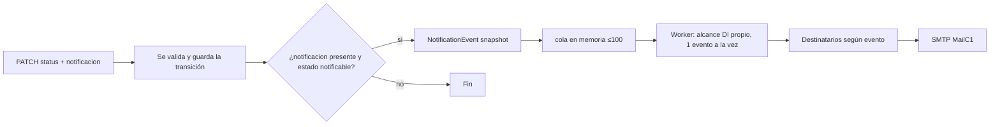

# Manual del Backend — `news-service`

> Manual de referencia de los contratos de la API del microservicio de noticias `news-service`. Relacionado con [[Proyecto]], [[Tsj-Web-plan-desarollo]] y [[backend-manual]].

- **Tecnología:** ASP.NET Core (`.NET 10`) — Minimal API, EF Core, PostgreSQL 18, JWT bearer con **Google ID tokens**, SMTP y OpenTelemetry opcional.
- **Ruta pública del servicio:** no hay prefijo global en la app; **Caddy** publica el servicio bajo `/news-service/*` y lo reenvía a `app-service:8080` (la app solo conoce `/`, `/health`, `/categories`, …).
  - Local: `http://localhost/news-service`
  - Producción: `https://tecmm.mx/news-service`
- **Formato de intercambio:** `application/json` (respuestas camelCase).
  - Solicitudes con cuerpo → cabecera `Content-Type: application/json`.
  - Respuestas correctas → JSON del recurso (`application/json`).
  - Respuestas de error → `application/problem+json` (ver [[#Errores]]).
- **Enums como texto:** los estados y roles se serializan como cadenas (`JsonStringEnumConverter`).

---

## Autenticación y autorización

### Cómo autenticarse

1. **Endpoints públicos** (`/public/*`, `GET /categories`, `/health`): **no requieren nada**; cualquiera puede leer.
2. **Endpoints editoriales y de gestión:** requieren enviar un **Google ID token** en la cabecera:

```http
Authorization: Bearer <google-id-token>
```

> [!note] Sin login propio
> El backend no emite tokens ni recibe código de autorización. El cliente obtiene el **ID token** de Google (flujo con su propia pantalla de login) y lo envía en cada petición. El JWT se valida contra `https://accounts.google.com` y su **audiencia** debe ser `GoogleAuth:ClientId`.
> Además, `OnTokenValidated` exige un correo **verificado** (`email_verified=true`) y que el dominio esté permitido (`GoogleAuth:AllowedEmailDomains`, con subdominios, ej. `zapopan.tecmm.edu.mx` también pasa).

### Políticas

| Política           | Qué requiere (`LocalUserRequirement`)             | Uso |
| ------------------ | ------------------------------------------------- | --- |
| *(ninguna, vacía)* | Solo un JWT válido (correo verificado + dominio permitido) | Grupos con `.RequireAuthorization()` a secas (`/campuses`, `/users/me*`) |
| `LocalUser`        | Usuario **local** activo, con rol asignado y campus  | `/relation-links` |
| `Admin`            | Rol `Admin`                                       | Mutaciones de `/campuses`, `/categories`, DELETE `/relation-links`, lectura de `/users` |
| `Editorial`        | `Admin`, `DirectorCampus`, `Editor` o `Writer`    | `/posts` (gestión editorial) |
| `UserManagement`   | `Admin` o `DirectorCampus`                        | `/users/pending`, `/users/deactivated`, `/users/{id}/role`, `/users/{id}/active` |

> [!warning] Antes de acceder a recursos de gestión
> El usuario **debe** existir localmente, estar `Active`, tener `campus` y un **rol asignado**. `LocalUserAuthorizationHandler` falla con `403`:
> - *"Complete campus selection before accessing this resource."* → no existe localmente (falta `PUT /users/me/campus`).
> - *"A role must be assigned before accessing this resource."* → aún sin rol (pendiente).
> - *"This user account is inactive."* → desactivado/bloqueado.

### Roles y jerarquía

| Rol                 | Nivel (enum)   | Permisos principales |
| ------------------- | -------------- | -------------------- |
| `Writer`            | `UserRole`     | Crear/editar sus borradores, `Draft → InReview` |
| `Editor`            | `UserRole`     | Redactar, revisar (InReview→Draft, Archived→Draft), eliminar posts del campus |
| `DirectorCampus`    | `DirectionRole`| Gestión de usuarios/roles **de su campus**, **publicar y archivar** posts de su campus |
| `Admin`             | `AdminRole`    | Todo: asignar roles (solo DirectorCampus), publicar/archivar en cualquier campus, borrar recursos |

> [!note] Jerarquía y permisos finos
> `GetRank`: `Admin` (3) > `DirectorCampus` (2) > `UserRole` (1). Reglas en `RolePermissions`:
> - `CanAssign`: `Admin` solo asigna `DirectorCampus`; `DirectorCampus` solo `Writer`/`Editor` (y solo dentro de su campus).
> - `CanRevoke`: `Admin` a cualquiera; `DirectorCampus` solo roles `UserRole` de su campus.
> - `CanUnlock`: desbloquear requiere **rol estrictamente superior**; desbloquear a un usuario sin rol lo permite `Admin`/`DirectorCampus`.
> - `CanPublicPost` (**pueden publicar/archivar**): `Admin` y `DirectorCampus` únicamente. `Editor` y `Writer` **no**.
> - `CanReviewPosts` (revisar): `Admin` y `Editor`.

---

## Índice de endpoints

| # | Método | Ruta | Autorización | Respuestas |
|---|--------|------|--------------|------------|
| 1 | `GET` | `/health` | Anónimo | 200 |
| 2 | `GET` | `/campuses` | JWT válido | 200, 401 |
| 3 | `GET` | `/campuses/{id}` | JWT válido | 200, 401, 404 |
| 4 | `POST` | `/campuses` | `Admin` | 201, 400, 401, 403, 409, 429 |
| 5 | `PUT` | `/campuses/{id}` | `Admin` | 200, 400, 401, 403, 404, 409, 429 |
| 6 | `DELETE` | `/campuses/{id}` | `Admin` | 204, 401, 403, 404, 409, 429 |
| 7 | `GET` | `/categories` | Anónimo | 200 |
| 8 | `GET` | `/categories/{id}` | Anónimo | 200, 404 |
| 9 | `POST` | `/categories` | `Admin` | 201, 400, 401, 403, 409, 429 |
| 10 | `PUT` | `/categories/{id}` | `Admin` | 200, 400, 401, 403, 404, 409, 429 |
| 11 | `DELETE` | `/categories/{id}` | `Admin` | 204, 401, 403, 404, 409, 429 |
| 12 | `GET` | `/relation-links` | `LocalUser` | 200, 401, 403 |
| 13 | `GET` | `/relation-links/{id}` | `LocalUser` | 200, 401, 403, 404 |
| 14 | `POST` | `/relation-links` | `LocalUser` | 201, 400, 401, 403, 409, 429 |
| 15 | `PUT` | `/relation-links/{id}` | `LocalUser` | 200, 400, 401, 403, 404, 409, 429 |
| 16 | `DELETE` | `/relation-links/{id}` | `Admin` | 204, 401, 403, 404, 409, 429 |
| 17 | `GET` | `/posts` | `Editorial` | 200, 401, 403 |
| 18 | `GET` | `/posts/{id}` | `Editorial` | 200, 401, 403, 404 |
| 19 | `POST` | `/posts` | `Editorial` | 201, 400, 401, 403, 404, 409, 429 |
| 20 | `PUT` | `/posts/{id}` | `Editorial` | 200, 400, 401, 403, 404, 409, 429 |
| 21 | `PATCH` | `/posts/{id}/status` | `Editorial` | 200, 400, 401, 403, 404, 429 |
| 22 | `DELETE` | `/posts/{id}` | `Editorial` (solo Editor del campus / Admin) | 204, 401, 403, 404, 429 |
| 23 | `GET` | `/public/posts?categorySlug={slug}` | Anónimo | 200 |
| 24 | `GET` | `/public/categories/{categorySlug}/posts` | Anónimo | 200 |
| 25 | `GET` | `/public/categories/{categorySlug}/posts/{postSlug}` | Anónimo | 200, 400, 404 |
| 26 | `GET` | `/public/headline` | Anónimo | 200, 404 |
| 27 | `GET` | `/users/me` | JWT válido | 200, 401 |
| 28 | `PUT` | `/users/me/campus` | JWT válido | 200, 400, 401, 403, 404, 429 |
| 29 | `GET` | `/users` | `Admin` | 200, 401, 403 |
| 30 | `GET` | `/users/{id}` | `Admin` | 200, 401, 403, 404 |
| 31 | `GET` | `/users/pending?page=1&pageSize=20` | `UserManagement` | 200, 400, 401, 403 |
| 32 | `GET` | `/users/deactivated?page=1&pageSize=20` | `UserManagement` | 200, 400, 401, 403 |
| 33 | `PUT` | `/users/{id}/role` | `UserManagement` | 204, 400, 401, 403, 404, 429 |
| 34 | `DELETE` | `/users/{id}/role` | `UserManagement` | 204, 401, 403, 404, 429 |
| 35 | `PATCH` | `/users/{id}/active` | `UserManagement` | 204, 400, 401, 403, 404, 429 |
| 36 | `DELETE` | `/users/{id}` | `Admin` | 204, 401, 403, 404, 429 |

> [!warning] Rate limiting de escritura
> Todos los métodos no seguros (`POST`, `PUT`, `PATCH`, `DELETE`) pasan por `WriteRateLimitMiddleware` (ver [[#Rate limiting (escrituras)]]) → pueden responder `429`. El `429` **no** pasa por el `ExceptionHandler`; lo escribe el middleware directamente.

---

## Endpoints de `Campus`

### Recurso `CampusResponse`

```json
{ "id": 3, "name": "Biblioteca Central" }
```

### 3.1 Listar campus

`GET /news-service/campuses`

- **Autorización:** JWT válido (dominio permitido); **sin** requerimiento de rol local.
- **Reglas:** ordenados por `name` ascendente.
- **Responses:** `200`, `401`.

### 3.2 Obtener un campus

`GET /news-service/campuses/{id}` (`id` entero)

- **Autorización:** JWT válido.
- **Reglas:** `404` si no existe.
- **Responses:** `200`, `401`, `404`.

### 3.3 Crear campus

`POST /news-service/campuses`

- **Autorización:** `Admin`.
- **Cuerpo requerido:** `name`.
- **Reglas de negocio:** `name` obligatorio y de **máx. 100 caracteres**. Nombre **único** (409 si se repite).
- **Responses:** `201` (recurso creado), `400`, `401`, `403`, `409`, `429`.

```json
{ "name": "Biblioteca Central" }
```

### 3.4 Actualizar campus

`PUT /news-service/campuses/{id}`

- **Autorización:** `Admin`.
- **Cuerpo:** mismo `CampusRequest` (reemplazo total).
- **Reglas:** `404` si no existe; nombre único (409). Puede reutilizarse un nombre tras el **borrado definitivo**.
- **Responses:** `200`, `400`, `401`, `403`, `404`, `409`, `429`.

### 3.5 Eliminar campus

`DELETE /news-service/campuses/{id}`

- **Autorización:** `Admin`.
- **Regla de negocio:** **no se puede eliminar** si tiene usuarios o posts asociados → `409`.
- **Responses:** `204 No Content`, `401`, `403`, `404`, `409`, `429`.

---

## Endpoints de `Categories`

### Recurso `CategoryResponse`

```json
{ "id": 1, "name": "Institucional", "slug": "institucional" }
```

### 4.1 Listar categorías

`GET /news-service/categories`

- **Autorización:** **anónima** (público de lectura).
- **Reglas:** ordenadas por `name`.
- **Responses:** `200`.

### 4.2 Obtener una categoría

`GET /news-service/categories/{id}`

- **Autorización:** anónima.
- **Responses:** `200`, `404`.

### 4.3 Crear categoría

`POST /news-service/categories`

- **Autorización:** `Admin`.
- **Cuerpo requerido:** `name` y `slug`.
- **Reglas:** ambos obligatorios y de **máx. 100 caracteres**. `name` **o** `slug` únicos (409).
- **Responses:** `201`, `400`, `401`, `403`, `409`, `429`.

```json
{ "name": "Institucional", "slug": "institucional" }
```

### 4.4 Actualizar categoría

`PUT /news-service/categories/{id}`

- **Autorización:** `Admin`.
- **Reglas:** reemplazo total; unicidad de `name`/`slug` (409); `404` si no existe.
- **Responses:** `200`, `400`, `401`, `403`, `404`, `409`, `429`.

### 4.5 Eliminar categoría

`DELETE /news-service/categories/{id}`

- **Autorización:** `Admin`.
- **Regla de negocio:** no se puede eliminar si tiene **posts asociados** → `409`.
- **Responses:** `204`, `401`, `403`, `404`, `409`, `429`.

---

## Endpoints de `RelationLinks`

### Recurso `RelationLinkResponse`

```json
{
  "id": 1,
  "icon": "globe",
  "label": "Sitio oficial",
  "url": "https://www.tsj.mx"
}
```

### 5.1 Listar enlaces

`GET /news-service/relation-links`

- **Autorización:** `LocalUser`.
- **Reglas:** ordenados por `label`.
- **Responses:** `200`, `401`, `403`.

### 5.2 Obtener un enlace

`GET /news-service/relation-links/{id}`

- **Autorización:** `LocalUser`.
- **Responses:** `200`, `401`, `403`, `404`.

### 5.3 Crear enlace

`POST /news-service/relation-links`

- **Autorización:** `LocalUser`.
- **Cuerpo requerido:** `icon`, `label` y `url`.
- **Reglas:** `icon` ≤ 20, `label` ≤ 50, `url` ≤ 255 caracteres. `url` debe ser **absoluta HTTP/HTTPS**. **Única** (409).
- **Responses:** `201`, `400`, `401`, `403`, `409`, `429`.

```json
{
  "icon": "globe",
  "label": "Sitio oficial",
  "url": "https://www.tsj.mx"
}
```

### 5.4 Actualizar enlace

`PUT /news-service/relation-links/{id}`

- **Autorización:** `LocalUser`.
- **Reglas:** reemplazo total; unicidad de URL (409); `404` si no existe.
- **Responses:** `200`, `400`, `401`, `403`, `404`, `409`, `429`.

### 5.5 Eliminar enlace

`DELETE /news-service/relation-links/{id}`

- **Autorización:** `Admin`.
- **Regla de negocio:** no se puede eliminar si está **asociado a un post** → `409`.
- **Responses:** `204`, `401`, `403`, `404`, `409`, `429`.

---

## Endpoints de `Posts`

### Estados de publicación (`PostPublicationStatus`)

`Draft` → `InReview` → `Published` · `Published` → `Archived`

> [!example] Mapa completo de transiciones permitidas
> | De | A | Quién | Nota |
> |----|----|-------|------|
> | `Draft` | `InReview` | Writer (propio borrador), Editor, Admin, DirectorCampus | Writer **solo** su borrador |
> | `InReview` | `Draft` | Editor, Admin, DirectorCampus (rechazo) | — |
> | `InReview` | `Published` | **`Admin` o `DirectorCampus`** | asigna `publishedAt` |
> | `Published` | `Archived` | **`Admin` o `DirectorCampus`** | requiere `reason` (siempre) |
> | `Archived` | `Draft` | Editor, Admin, DirectorCampus | — |
>
> - Un **`Draft` solo puede modificarlo o transicionarlo su autor** (`authorId == actor.id`).
> - Un **`Writer` solo edita borradores** (`Draft`) y solo puede hacer `Draft → InReview`.
> - `Editor` **no publica ni archiva** (solo Admin/DirectorCampus — `CanPublicPost`).
> - Sin cambio de estado (`status == post.Status`) → `400` (`ValidationException`).
> - **Cambio de la feature 1.3.0:** `Editor` ya **no** puede publicar/archivar (antes sí).

### Recurso `PostResponse`

```json
{
  "id": 7,
  "title": "Resultados del Open Day 2026",
  "slug": "resultados-open-day-2026",
  "description": "Conoce los resultados de las actividades del Open Day.",
  "coverImage": "https://cdn.example.com/covers/open-day.jpg",
  "mdxBody": "## Resultados\n\n¡Gracias a todos los asistentes!",
  "headLine": true,
  "authorName": "Efraín Martínez",
  "authorId": 12,
  "status": "Published",
  "categoryId": 1,
  "categoryName": "Institucional",
  "campusId": 3,
  "campusName": "Unidad Académica Ejemplo",
  "publishedAt": "2026-09-21T20:00:00Z",
  "createdAt": "2026-09-20T10:00:00Z",
  "updatedAt": "2026-09-21T20:00:00Z",
  "relationLinks": [
    { "id": 1, "icon": "globe", "label": "Sitio oficial", "url": "https://www.tsj.mx" }
  ]
}
```

> [!note] Filtrado por rol de los listados editoriales
> `GET /posts` y `GET /posts/{id}` (y `ScopedPosts`):
> - Un **`Draft` solo es visible, editable y transicionable por su autor** (`authorId == actor.id`), incluido para `Admin`.
> - `Admin`: ve todos los estados en **cualquier campus**, pero solo **sus propios** borradores.
> - `DirectorCampus`, `Editor` y `Writer`: solo posts **de su campus** (`campusId == actor.CampusId`) y solo los borradores propios.

### 6.1 Listar posts (editorial)

`GET /news-service/posts`

- **Autorización:** `Editorial`.
- **Reglas:** devuelve los posts visibles al actor (ver nota de filtrado), ordenados por `createdAt` descendente.
- **Responses:** `200`, `401`, `403`.

### 6.2 Obtener un post (editorial)

`GET /news-service/posts/{id}`

- **Autorización:** `Editorial`.
- **Reglas:** `404` si no existe **o** no está dentro del scope del actor (borrador ajeno → `404`).
- **Responses:** `200`, `401`, `403`, `404`.

### 6.3 Crear post

`POST /news-service/posts`

- **Autorización:** `Editorial`.
- **Cuerpo requerido:** `title`, `slug`, `description`, `mdxBody`; `headLine` (bool); `categoryId`, `campusId`.
  - Opcionales: `coverImage` (URL absoluta HTTP/HTTPS), `relationLinkIds` (lista de ids).
- **Reglas de validación:**
  - `title` obligatorio, ≤ 150; `slug` obligatorio, ≤ 20; `description` obligatorio, ≤ 255; `mdxBody` obligatorio; `coverImage` ≤ 255.
  - `categoryId` y `campusId` > 0; `relationLinkIds` con ids **únicos y positivos**.
  - `slug` **único** (409).
  - `campusId` debe ser el **campus del actor** (a menos que sea `Admin`).
  - Las referencias (categoría, campus, enlaces) deben existir → `404` si alguna no existe.
- **Autor/estado:** se autocompletan (`authorName`, `authorId` del actor; `status = Draft`).
- **Responses:** `201` (recurso), `400`, `401`, `403`, `404`, `409`, `429`.

```json
{
  "title": "Resultados del Open Day 2026",
  "slug": "resultados-open-day-2026",
  "description": "Conoce los resultados de las actividades del Open Day.",
  "coverImage": "https://cdn.example.com/covers/open-day.jpg",
  "mdxBody": "## Resultados\n\n¡Gracias a todos los asistentes!",
  "headLine": true,
  "categoryId": 1,
  "campusId": 3,
  "relationLinkIds": [1]
}
```

### 6.4 Actualizar post

`PUT /news-service/posts/{id}`

- **Autorización:** `Editorial`.
- **Reglas:** reemplazo total con el mismo `PostRequest`. Un `Writer` solo puede editar **borradores**; un `Draft` solo su **autor**; unicidad de `slug` (409); `404` si no existe.
- **Responses:** `200`, `400`, `401`, `403`, `404`, `409`, `429`.

### 6.5 Transición de estado (con/sin notificación) — `FEATURE 1.3.0`

`PATCH /news-service/posts/{id}/status`

- **Autorización:** `Editorial` (con las reglas de transición de la tabla de estados).
- **Cuerpo:** `status` (obligatorio), `reason`, `notificacion` (opcional).

```json
{ "status": "InReview", "notificacion": { "urlRevision": "https://sitio.example/editor/noticias/7" } }
```

```json
{ "status": "Published", "notificacion": { "urlNoticia": "https://sitio.example/noticias/resultados-open-day-2026" } }
```

```json
{ "status": "Archived", "reason": "La información fue sustituida por una actualización.", "notificacion": {} }
```

- **Reglas:**
  - `Archived` **siempre** requiere `reason` no vacío (`400` si falta), con o sin notificación.
  - Al pasar a `Published` se asigna `publishedAt = DateTime.UtcNow`.
  - `notificacion` es un **opt-in**. `null` o su ausencia → sin correo.
  - `InReview` usa `urlRevision`; `Published` usa `urlNoticia`; `Archived` no usa link.
- **Responses:** `200` (recurso actualizado), `400`, `401`, `403`, `404`, `429`.

> [!warning] Confirmación ≠ entrega del correo
> Un `200` confirma que la **transición se guardó**. La notificación es *best-effort* (cola en memoria + SMTP). Link faltante/inválido o SMTP caído **no revierte** el cambio de estado; se registra `ERROR` en logs. Ver [[#Notificaciones editoriales]].

### 6.6 Eliminar post

`DELETE /news-service/posts/{id}`

- **Autorización:** `Editorial`. Regla extra: **solo `Editor` del campus del post o `Admin`** (`CanDeletePosts`).
- **Reglas:** `404` si no existe. Borrado definitivo (permite reutilizar el `slug`).
- **Responses:** `204`, `401`, `403`, `404`, `429`.

### 6.7 Posts públicos (solo publicados)

`GET /news-service/public/posts?categorySlug={slug}` · `GET /news-service/public/categories/{categorySlug}/posts`

- **Autorización:** anónima.
- **Reglas:** solo `Published`, ordenados por `publishedAt` desc y luego `id` desc. `categorySlug` filtra por slug de categoría (opcional en la primera ruta, obligatorio en las otras).
- **Responses:** `200`.

### 6.8 Un post público

`GET /news-service/public/categories/{categorySlug}/posts/{postSlug}`

- **Autorización:** anónima.
- **Reglas:** `400` si faltan slugs; `404` si no hay un post publicado con esa categoría+slug.
- **Responses:** `200`, `400`, `404`.

### 6.9 Titular (headline) público

`GET /news-service/public/headline`

- **Autorización:** anónima.
- **Reglas:** último `Published` con `headLine=true` (por `publishedAt`/`id` desc). `404` si no hay titular publicado.
- **Responses:** `200`, `404`.

### Recurso `PublicPostResponse`

```json
{
  "title": "Resultados del Open Day 2026",
  "slug": "resultados-open-day-2026",
  "description": "Conoce los resultados de las actividades del Open Day.",
  "coverImage": "https://cdn.example.com/covers/open-day.jpg",
  "mdxBody": "## Resultados\n\n¡Gracias a todos los asistentes!",
  "headLine": true,
  "authorName": "Efraín Martínez",
  "categorySlug": "institucional",
  "categoryName": "Institucional",
  "campusId": 3,
  "campusName": "Unidad Académica Ejemplo",
  "publishedAt": "2026-09-21T20:00:00Z",
  "relationLinks": [ { "id": 1, "icon": "globe", "label": "Sitio oficial", "url": "https://www.tsj.mx" } ]
}
```

---

## Endpoints de `Users`

### Recursos

`CurrentUserResponse` (`GET /users/me`):

```json
{
  "id": 12,
  "googleSubject": "1159547…",
  "email": "efrain.martinez@tecmm.edu.mx",
  "name": "Efraín Martínez",
  "isRegistered": true,
  "active": true,
  "role": "Editor",
  "campusId": 3
}
```

`UserResponse` (listados/`GET`):

```json
{
  "id": 12,
  "email": "efrain.martinez@tecmm.edu.mx",
  "name": "Efraín Martínez",
  "active": true,
  "role": "Editor",
  "campusId": 3,
  "campusName": "Unidad Académica Ejemplo"
}
```

`PendingUsersResponse` (listados paginados):

```json
{
  "items": [
    { "id": 12, "email": "efrain.martinez@tecmm.edu.mx", "name": "Efraín Martínez", "active": true, "role": null, "campusId": 3, "campusName": "Unidad Académica Ejemplo" }
  ],
  "page": 1,
  "pageSize": 20,
  "totalCount": 1
}
```

### 7.1 Mi perfil

`GET /news-service/users/me`

- **Autorización:** JWT válido.
- **Reglas:** `id`, `active`, `role`, `campusId` vienen `null` mientras el usuario no exista localmente (`isRegistered: false`).
- **Responses:** `200`, `401`.

### 7.2 Seleccionar mi campus (auto-registro)

`PUT /news-service/users/me/campus`

- **Autorización:** JWT válido.
- **Cuerpo:** `{ "campusId": 3 }`.
- **Reglas:** crea el usuario local (si no existe) y asigna el campus. **No se puede cambiar el campus después de asignar un rol** → `403`.
- **Responses:** `200` (`CurrentUserResponse`), `400`, `401`, `403`, `404` (campus inexistente), `429`.

### 7.3 Listar usuarios

`GET /news-service/users`

- **Autorización:** `Admin`.
- **Reglas:** todos los usuarios.
- **Responses:** `200`, `401`, `403`.

### 7.4 Obtener un usuario

`GET /news-service/users/{id}`

- **Autorización:** `Admin`.
- **Responses:** `200`, `401`, `403`, `404`.

### 7.5 Usuarios pendientes

`GET /news-service/users/pending?page=1&pageSize=20`

- **Autorización:** `UserManagement`.
- **Reglas:** paginación (`page ≥ 1`, `pageSize 1–100`; `400` si no). Filtra usuarios sin rol asignado (pendientes de asignación).
- **Responses:** `200`, `400`, `401`, `403`.

### 7.6 Usuarios desactivados

`GET /news-service/users/deactivated?page=1&pageSize=20`

- **Autorización:** `UserManagement`.
- **Reglas:** paginación igual; usuarios `Deactivated`.
- **Responses:** `200`, `400`, `401`, `403`.

### 7.7 Asignar rol

`PUT /news-service/users/{id}/role`

- **Autorización:** `UserManagement`.
- **Cuerpo:** `{ "role": "DirectorCampus", "campusId": 3 }`.
- **Reglas:**
  - `CanAssign`: `Admin` solo `DirectorCampus`; `DirectorCampus` solo `Writer`/`Editor`.
  - `Admin`: fija `campusId` y `role`.
  - `DirectorCampus`: solo dentro de **su propio campus** (ambos `campusId` → `403` si no coincide).
  - `404` si el usuario no existe; `400` si el rol no es asignable.
- **Responses:** `204`, `400`, `401`, `403`, `404`, `429`.

### 7.8 Revocar rol

`DELETE /news-service/users/{id}/role`

- **Autorización:** `UserManagement`.
- **Reglas:** `CanRevoke` (`Admin` a cualquier rol; `DirectorCampus` solo `Writer`/`Editor` de su campus → `403`). Pone `role = null`.
- **Responses:** `204`, `401`, `403`, `404`, `429`.

### 7.9 Activar / desactivar usuario

`PATCH /news-service/users/{id}/active`

- **Autorización:** `UserManagement`.
- **Cuerpo:** `{ "active": false }`.
- **Reglas:** `CanUpdateAccess` (`Admin`/`DirectorCampus`). `DirectorCampus` solo usuarios de su campus. Al **desbloquear** (`active: true`) se exige **rol estrictamente superior** (`CanUnlock`). Borra `lockedUntil`.
- **Responses:** `204`, `400`, `401`, `403`, `404`, `429`.

### 7.10 Eliminar usuario

`DELETE /news-service/users/{id}`

- **Autorización:** `Admin`.
- **Responses:** `204`, `401`, `403`, `404`, `429`.

---

## Notificaciones editoriales — `FEATURE 1.3.0`

> [!info] Qué es
> Al transicionar un post (`PATCH /posts/{id}/status`) el llamador puede **optar por aviso por correo** enviando `notificacion`. Un **`NotificationWorker`** en segundo plano envía los correos desde una cola en memoria. Es *best-effort*: **nunca revierte** la transición ya guardada.

### Flujo



1. La transición se **guarda primero**; si el enqueue o el envío falla, solo se registra en logs.
2. `NotificationEvent` es un **snapshot inmutable** (sin entidades rastreadas): `title`, `authorId/Name`, `campusId/Name`, actor, resumen (≤200 puntos de código del `mdxBody` normalizado + `…`), timestamps, `reason`, `urlRevision`/`urlNoticia`.

### Destinatarios

| Evento | Destinatarios | Excluye |
|--------|---------------|---------|
| `InReview` | `Editor` **activos** del campus del post | cuentas desactivadas/bloqueadas |
| `Published` | `Admin` (todos) + `DirectorCampus` del campus | al **actor** que publicó y cuentas inactivas |
| `Archived` | **el autor del post** (`authorId`) | si `authorId` es `null` (post sin autor local) → **0 destinatarios** + warning |

- Deduplicación por correo (case-insensitive).
- Para eventos por rol (`InReview`/`Published`) se filtran `AccessStatus == Active` y `lockedUntil` vencido.

### Cola y worker

- Canal acotado en memoria (`Channel.CreateBounded(100)`, `FullMode=Wait`): **no se persiste**; los eventos se pierden si el proceso termina.
- `TryEnqueue` es no bloqueante → si la cola está **llena o cerrada** se omite el evento y se registra `ERROR` (la transición sigue guardada).
- El worker consume **secuencialmente**, con un **scope de DI nuevo por evento** (evita arrastrar el contexto de la petición HTTP).

### Plantillas HTML (embebidas)

`Resources/HtmlTemplates/*.html` compiladas como `EmbeddedResource` (`InReviewNotificationHtml.html`, `PublishedNotificationHtml.html`, `ArchivedNotificationHtml.html`). Marcadores `{{campo}}` (escapados una sola vez por `TemplateRenderer`):

| Plantilla | Marcadores |
|-----------|------------|
| InReview | `tituloNoticia`, `autor`, `unidad`, `resumenNoticia`, `fechaSolicitud`, `urlRevision` |
| Published | `tituloNoticia`, `autor`, `unidad`, `resumenNoticia`, `fechaPublicacion`, `publicadoPor`, `urlNoticia` |
| Archived | `tituloNoticia`, `autor`, `unidad`, `resumenNoticia`, `fechaArchivado`, `motivoArchivado` |

- Asunto: `Noticia pendiente de revisión: <título>` / `Noticia publicada: <título>` / `Noticia archivada: <título>`.
- Si falta un marcador o el link es inválido → se registra `ERROR` y **no se envía** (no se pide el link).

### SMTP (`MailC1`)

- Sección `MailC1`: `Address`, `SenderName` (`Tecnológico Superior de Jalisco`), `SmtpHost` (`smtp.gmail.com`), `SmtpPort` (`587`), `SmtpUsername`, `SmtpPassword`.
- UTF-8, HTML, **timeout de 30 s** por envío; credenciales validadas **al momento de enviar** (la app arranca aunque falten).
- `EmailNotifier` contiene errores por destinatario: un fallo de SMTP **no detiene** a los demás.
- En compose, las variables son `MAIL_C1_*` y todas **opcionales** (si están vacías y se pide una notificación, el envío falla y se registra `ERROR`).

> [!tip] Seguridad de la configuración
> `SmtpUsername`/`SmtpPassword` se inyectan por entorno (`MAIL_C1_SMTP_*`) y **nunca se registran**. La recomendación de Gmail es usar una **App Password** dedicada. Se eliminó el flujo OAuth del correo en la 1.3.0.

### Telemetría — `FEATURE 1.3.0` (OpenTelemetry/OTLP, opcional)

- Se activa **solo si** `OTEL_EXPORTER_OTLP_ENDPOINT` está definido y es una URI absoluta `http/https` **sin query ni fragment**; el protocolo debe ser `http/protobuf` (o estar vacío).
- Señales exportadas: **logs**, **traces** y **metrics** a `<endpoint>/v1/logs`, `/v1/traces` y `/v1/metrics` (timeout 5 s).
- `/health` se **excluye** de los traces (`AspNetCoreInstrumentation.Filter`).
- Atributos: `service.name` (`OTEL_SERVICE_NAME`, por defecto `news-service`) y `deployment.environment.name`.
- Cabeceras OTLP opcionales: `OTEL_EXPORTER_OTLP_HEADERS`.
- En compose las variables OTLP vienen **comentadas** (pendiente el servidor de métricas — Alloy). Una configuración rota **nunca bloquea el arranque** (solo advierte en logs).

---

## Errores

Todos los errores se devuelven como `application/problem+json`:

```json
{
  "status": 404,
  "title": "Resource not found",
  "detail": "Post not found.",
  "type": "https://httpstatuses.com/404",
  "instance": "/news-service/posts/99"
}
```

| Código | `title` | Cuándo | Fuente |
|--------|---------|--------|--------|
| `400` | `Invalid request` | Cuerpo JSON malformado/no parseable | `BadHttpRequestException` (ExceptionHandler) |
| `400` | `Validation failed` | Entrada inválida / transición no permitida / archivar sin `reason` / slugs vacíos | `ValidationException` |
| `401` | `Unauthorized` | Falta/sin `sub`/token inválido (middleware `UseStatusCodePages`) | `UnauthorizedException` / status pages |
| `403` | `Forbidden` | Rol, campus o permiso fino insuficiente; usuario local requerido | `ForbiddenException` / status pages |
| `404` | `Resource not found` | Recurso inexistente (o borrador ajeno visto como inexistente) | `NotFoundException` |
| `409` | `Resource conflict` | Duplicados (`campus.name`, `category.name/slug`, `link.url`, `post.slug`) o borrado con dependencias | `ConflictException` |
| `422` | `Business rule violation` | Reglas de negocio (p. ej. eliminación de campus con usuarios) | `BusinessException` |
| `429` | `Too many write requests` | Rate limit de escritura excedido | `WriteRateLimitMiddleware` |
| `500` | `Internal Server Error` | Excepción no controlada | ExceptionHandler |

> [!note] 401/403 del middleware
> `UseStatusCodePages` convierte en `problem+json` los `401`/`403` que genera el pipeline de auth (token ausente/inválido). Detalle por defecto: *"A valid Google ID token is required."* (401) / *"You do not have permission to perform this action."* (403).

### Ejemplos reales

`400` por transición no permitida:

```json
{
  "status": 400,
  "title": "Validation failed",
  "detail": "The requested publication state transition is not allowed.",
  "instance": "/news-service/posts/7/status"
}
```

`409` por slug duplicado:

```json
{
  "status": 409,
  "title": "Resource conflict",
  "detail": "A post with the same slug already exists.",
  "instance": "/news-service/posts"
}
```

`429` del middleware (fuera del ExceptionHandler, con `Retry-After` cuando hay bloqueo):

```json
{
  "status": 429,
  "title": "Too many write requests",
  "detail": "The write-request limit was exceeded. Retry after the indicated delay.",
  "instance": "/news-service/posts"
}
```

---

## Rate limiting (escrituras)

| Regla | Valor actual (`WriteRateLimiting`) |
|-------|-------------------------------------|
| Métodos limitados | `POST`, `PUT`, `PATCH`, `DELETE` (lecturas y `/health` se omiten) |
| Límite por ventana | **30 peticiones / 1 min** (`PermitLimit`, `PermitWindow`) |
| Partición | por **IP** y por **subject (Google)** cuando hay sesión — ambas cuentan |
| Ventana de infracciones | 15 min (`InfractionWindow`) |
| Bloqueo de IP | ≥ **5** infracciones en la ventana → IP bloqueada **15 min** (`IpBlockThreshold`, `IpBlockDuration`) — `RateLimitIpBlocks` (BD) |
| Desactivar cuenta | ≥ **15** infracciones → usuario local `Deactivated` (`AccountDeactivationThreshold`) — `RateLimitInfractions` (BD) |

> [!warning] Alcance en memoria
> El contador de peticiones (`WriteRequestRateLimiter`) vive **en memoria** del proceso (una instancia); las **sanciones** (bloqueos/desactivaciones) sí son **durables** en PostgreSQL. El middleware parte confiando en `X-Forwarded-For` de Caddy (`KnownIPNetworks/Proxies` vacíos) para conocer la IP real del cliente.

---

## Cambios recientes en git (21–22 sep 2026) — FEATURE `1.3.0`

> [!example] Esta sección documenta el **estado actual** de la API; los cambios de git del **21–22 de septiembre de 2026** (commits `b7ddfce…1675105`) que se despliegan junto a esta nota son:

| Fecha | Commit | Cambio |
|-------|--------|--------|
| 2026-09-21 11:48 | `b7ddfce` | **Filtro de Draft por rol**: los borradores solo los ve su autor; `Author` (texto) → `AuthorName` + `AuthorId` en posts (migración `RenameAuthorToAuthorName` con backfill por nombre). |
| 2026-09-21 13:20 | `560ad1f` | **Versionado aplicado** (se fija la base 1.3.0 del backend). |
| 2026-09-21 16:22–16:33 | `5ae6bfb`, `98e5ed9`, `3c34b64`, `92d851e`, `06defec` | **Notificaciones por Email**: plantillas HTML + `TemplateRenderer`, snapshot de `NotificationEvent`, `notificacion` en `PATCH status`, configuración SMTP `MailC1`, pruebas. |
| 2026-09-21 16:46 | `252c398` | **`NotificationWorker`**: cola en memoria ≤100 + hosted service para correos masivos asíncronos. |
| 2026-09-21 21:46 | `73fd7b3` | **OpenTelemetry** (logs/traces/metrics OTLP opcional) y arranque del correo vía Google. |
| 2026-09-22 12:41 | `1675105` | **SMTP básico**: se eliminan los archivos OAuth del correo (`GoogleAccessTokenProvider.cs`, `IGoogleAccessTokenProvider.cs`), se publica `EmailSender` SMTP con app password; telemetría a Alloy pendiente (quedan comentadas las variables OTLP del `compose.yaml`). |

**Cambios funcionales que introdujo esta feature (reflejados en este manual):**

- `PATCH /posts/{id}/status` ahora acepta `notificacion` (opt-in) y **archivar siempre requiere `reason`**.
- `Editor` **ya no publica ni archiva**; publicar/archivar quedó exclusivo de `Admin`/`DirectorCampus`.
- Los **borradores** (`Draft`) solo se listan/editan/transicionan por **su autor**.
- Los posts de autoría guardan `AuthorName` (denormalizado) + `AuthorId` (FK a `users`, `Restrict`).
- La API quedó versionada como **1.3.0** para esta entrega.

> [!warning] `docs/plan-notificaciones.md` (referenciado por el README raíz) **no existía** al momento de escribir este manual; los límites y decisiones de diseño de notificaciones aquí documentados provienen del código (`Common/Notifications`, `PostService`).

---

## Relacionado

- [[Proyecto]] — vista general del proyecto.
- [[Tsj-Web-plan-desarollo]] — plan de desarrollo con FASEs, pendientes y decisiones.
- [[backend-manual]] — manual del microservicio backend `tsj-core` (estilo de referencia).
- [[to-production-manual]] — despliegue con `to-production.sh` (registra la línea `1.3.0` en `docs/versions/version-history.txt`).

---

## Referencias a código fuente

| Tema | Archivo |
|------|---------|
| Rutas, verbos, políticas y handlers | `news-service/Modules/{CampusModule,CategoriesModule,PostsModule,RelationLinksModule,UsersModule}/` (`Module.cs`, `Controller/*.cs`) |
| Servicios y reglas de negocio | `news-service/Modules/{CampusModule,CategoriesModule,RelationLinksModule,PostsModule,UsersModule}/Services/*.cs` |
| Permisos por rol | `news-service/Common/Security/RolePermissions.cs`, `RoleLevels.cs`, `LocalUserAuthorizationHandler.cs`, `AuthorizationPolicies.cs` |
| Auth Google ID token | `news-service/Common/Security/GoogleAuthenticationExtensions.cs`, `GoogleAuthOptions.cs` |
| Notificaciones (cola, worker, snapshot, plantillas) | `news-service/Common/Notifications/*`, `Common/Html/TemplateRenderer.cs`, `Modules/PostsModule/Dto/Request/PostNotificationRequest.cs` |
| SMTP `MailC1` | `news-service/Common/Notifications/Email/*.cs` (`EmailSender`, `EmailNotifier`, `MailC1Options`) |
| Telemetría OTLP | `news-service/Common/Telemetry/TelemetryModule.cs`, `TelemetryOptions.cs` |
| Rate limiting de escritura | `news-service/Common/RateLimiting/*.cs` |
| Mapa errores → HTTP | `news-service/ExceptionHandling/GlobalExceptionHandler.cs`, `news-service/Common/Exceptions/*.cs` |
| DTOs | `news-service/Modules/*/Dto/{Request,Response}/` |
| Modelos y esquema | `news-service/Data/Models/*.cs`, `news-service/Modules/DbContext/Migrations/*` |
| Config operativa | `news-service/appsettings.json`, `compose.yaml`, `caddy/Caddyfile`, `news-service/.env.example` |
| Ejemplos de llamadas | `news-service/news-service.http` |
