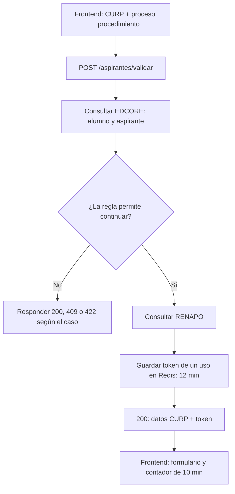
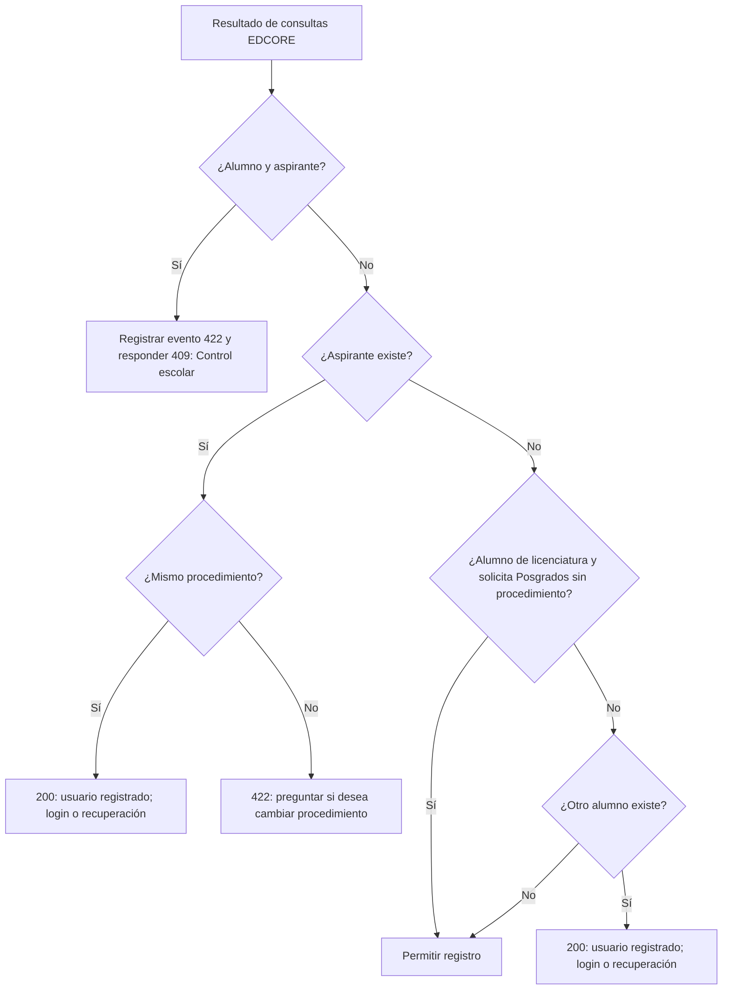
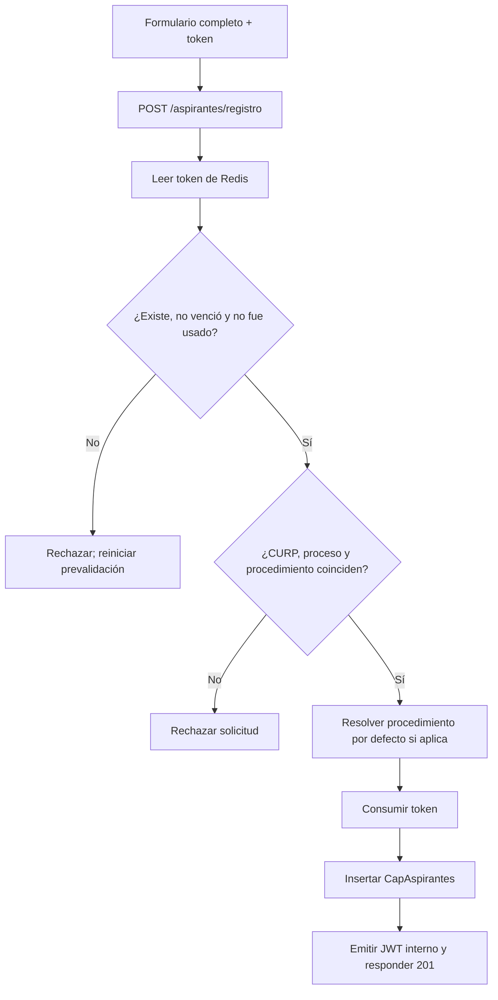
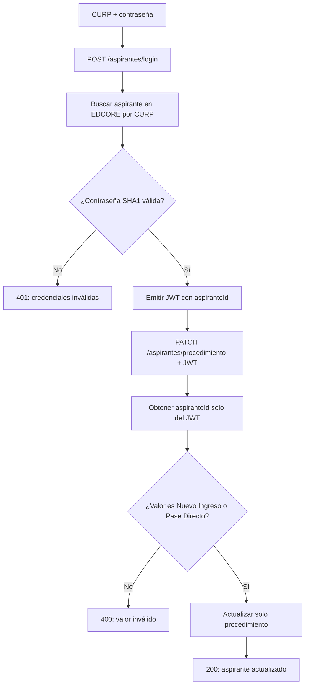

# Reglas de negocio — Registro de aspirantes

> Contrato funcional para diseño frontend y liderazgo técnico. Describe la validación, registro, sesión interna y cambio de procedimiento de aspirantes. Estado: borrador pendiente de integración al subplan.

## Resumen

El aspirante es una identidad interna de EDCORE. El flujo separa la **prevalidación** de la **alta**: primero se decide si la CURP puede registrarse y se obtienen datos RENAPO; después se crea el aspirante con un token temporal de Redis.

## Requisitos previos

- La API usa la base `/tsj-api` y cuerpos `application/json` en camelCase.
- El formulario obtiene CURP, proceso y procedimiento antes de iniciar la prevalidación.
- `proceso` admite `Licenciaturas` o `Posgrados`; `Pase Directo` no es un proceso válido del API.
- `procedimiento` admite `Nuevo Ingreso` o `Pase Directo`.
- Para alumno existente de licenciatura que solicita Posgrados, `procedimiento` debe omitirse en la prevalidación.

## Uso / Pasos

### 1. Prevalidar una CURP

1. El frontend envía CURP, proceso y procedimiento a `POST /aspirantes/validar`.
2. El backend consulta EDCORE tanto para alumno como para aspirante.
3. Si puede continuar, consulta RENAPO, devuelve datos CURP y un token temporal.
4. El frontend muestra los datos precargados y una cuenta regresiva de 10 minutos.
5. El token vence a los 12 minutos y se consume una sola vez al registrar.



Pseudocódigo de las consultas iniciales:

```text
alumno = EDCORE.Users
    .JOIN(EDCORE.UserStudents, user_IdUser)
    .JOIN(EDCORE.Programs, prog_IdProgram)
    .WHERE(curp == solicitud.curp)
    .SELECT(prog_IdLevel)

aspirante = EDCORE.CapAspirantes
    .WHERE(curp == solicitud.curp)
    .SELECT(id, procedimiento, proceso, status)

resultado = evaluarReglas(alumno, aspirante, solicitud)
SI resultado.permiteRegistro:
    datosCurp = RENAPO.consultar(solicitud.curp)
    token = Redis.guardarUnaVez(curp, proceso, procedimiento, TTL = 12 minutos)
    RESPONDER 200(datosCurp, token)
SINO:
    RESPONDER resultado.httpStatus
```

### 2. Resolver los casos EDCORE

| Caso | Condición | Acción frontend | Respuesta API |
|---|---|---|---|
| Inconsistencia | La CURP aparece como alumno y aspirante | Mostrar mensaje para acudir a control escolar; no mostrar registro ni login. | `409` |
| Aspirante existente, mismo procedimiento | El procedimiento solicitado coincide | Dirigir a login o recuperación de contraseña. | `200` con `usuarioRegistrado` |
| Aspirante existente, procedimiento distinto | Nuevo Ingreso ↔ Pase Directo | Mostrar procedimiento actual y dirigir a login para cambiarlo. | `422` Problem Details |
| Alumno de licenciatura | `prog_IdLevel != 7`, solicita Posgrados y omite procedimiento | Continuar al formulario de registro; el alta usará Nuevo Ingreso. | `200` con token y datos CURP |
| Otro alumno existente | Incluye maestría (`prog_IdLevel = 7`) o solicitud distinta | Dirigir a login o recuperación de contraseña. | `200` con `usuarioRegistrado` |
| Sin registro EDCORE | No existe alumno ni aspirante | Continuar al formulario de registro. | `200` con token y datos CURP |

> El backend registra la inconsistencia alumno+aspirante como evento de regla de negocio 422, pero nunca expone ese detalle: el cliente recibe `409`.



Pseudocódigo de decisión. `prog_IdLevel == 7` significa maestría; cualquier otro nivel significa licenciatura:

```text
SI alumno.existe Y aspirante.existe:
    logger.reglaNegocio(422, "CURP en alumno y aspirante")
    RESPONDER 409(controlEscolar)

SI aspirante.existe:
    SI aspirante.procedimiento == solicitud.procedimiento:
        RESPONDER 200(usuarioRegistrado)
    SINO:
        RESPONDER 422("Tu procedimiento actual es {actual}. ¿Deseas cambiarlo a {solicitado}?")

SI alumno.existe Y alumno.prog_IdLevel != 7
   Y solicitud.proceso == Posgrados
   Y solicitud.procedimiento ES omitido:
    PERMITIR registro

SI alumno.existe:
    RESPONDER 200(usuarioRegistrado)

PERMITIR registro
```

### 3. Registrar un aspirante

1. El usuario completa correo, celular, contraseña y los datos de aspirante.
2. El frontend envía el token de prevalidación junto con la entidad completa a `POST /aspirantes/registro`.
3. El backend comprueba que CURP, proceso y procedimiento coinciden con el token Redis; no vuelve a consultar EDCORE ni RENAPO.
4. El backend consume el token, crea el registro en `CapAspirantes` y devuelve JWT interno.
5. Para el caso Posgrados de alumno de licenciatura, `procedimiento` se omite y el backend inserta `Nuevo Ingreso`.



Pseudocódigo de registro. Esta operación no vuelve a consultar EDCORE ni RENAPO:

```text
token = Redis.obtener(tokenValidacion)
SI token NO existe O token.usado O token.expirado:
    RESPONDER error de token inválido

procedimientoEfectivo = solicitud.procedimiento
SI token.proceso == Posgrados Y token.procedimiento ES omitido:
    procedimientoEfectivo = NuevoIngreso

SI token.curp != solicitud.curp
   O token.proceso != solicitud.proceso
   O token.procedimiento != solicitud.procedimiento (salvo la excepción Posgrados):
    RESPONDER error de token no coincide

Redis.consumir(token)
aspirante = EDCORE.CapAspirantes.INSERT(solicitud, procedimientoEfectivo)
jwt = emitirJwtInterno(aspirante.id)
RESPONDER 201(aspirante, jwt)
```

### 4. Iniciar sesión y cambiar procedimiento

1. Un aspirante existente inicia sesión con CURP y contraseña mediante `POST /aspirantes/login`.
2. El backend valida la contraseña almacenada en EDCORE y devuelve un JWT interno con su `aspiranteId`.
3. Con ese JWT, el frontend puede llamar `PATCH /aspirantes/procedimiento` para cambiar únicamente entre Nuevo Ingreso y Pase Directo.
4. El aspirante nunca puede modificar el procedimiento de otra CURP.



Pseudocódigo de autenticación y cambio:

```text
aspirante = EDCORE.CapAspirantes.WHERE(curp == login.curp).FIRST_OR_DEFAULT()
SI aspirante NO existe O !comparacionTiempoConstante(SHA1(login.contrasena), aspirante.contrasena):
    RESPONDER 401("Credenciales inválidas")

jwt = emitirJwtInterno(aspirante.id)
RESPONDER 200(jwt, aspirante)

// PATCH /procedimiento
aspiranteId = jwt.claim("aspiranteId")
SI solicitud.procedimiento NO ESTA EN [NuevoIngreso, PaseDirecto]:
    RESPONDER 400

EDCORE.CapAspirantes.WHERE(id == aspiranteId)
    .UPDATE(procedimiento = solicitud.procedimiento)
RESPONDER 200(aspirante actualizado)
```

## Contratos API

### Valores controlados

| Campo | Valores permitidos |
|---|---|
| `proceso` | `Licenciaturas`, `Posgrados` |
| `procedimiento` | `Nuevo Ingreso`, `Pase Directo` |
| `status` EDCORE | `Interesado`, `Aspirante`, `Alumno` |

### `POST /tsj-api/aspirantes/validar`

Solicitud normal:

```json
{
  "curp": "ABCD010101HMCXXX01",
  "proceso": "Licenciaturas",
  "procedimiento": "Nuevo Ingreso"
}
```

Solicitud de Posgrados para alumno de licenciatura:

```json
{
  "curp": "ABCD010101HMCXXX01",
  "proceso": "Posgrados"
}
```

Respuesta permitida (`200`):

```json
{
  "puedeRegistrarse": true,
  "tokenValidacion": "token-opaco",
  "expiraEnSegundos": 720,
  "datosCurp": {
    "curp": "ABCD010101HMCXXX01",
    "nombre": "Nombre",
    "apellidoPaterno": "Apellido",
    "apellidoMaterno": "Segundo Apellido",
    "sexo": "H",
    "fechaNacimiento": "2001-01-01",
    "statusCurp": "correcto"
  }
}
```

Usuario existente (`200`):

```json
{
  "usuarioRegistrado": true,
  "mensaje": "Usuario registrado, acude a servicios escolares o recupera tu contraseña"
}
```

Conflicto aspirante/alumno (`409`): `application/problem+json` con instrucción para acudir a control escolar.

Procedimiento distinto (`422`): `application/problem+json` con: `Tu procedimiento actual es {actual}. ¿Deseas cambiarlo a {solicitado}?`.

### `POST /tsj-api/aspirantes/registro`

Solicitud:

```json
{
  "tokenValidacion": "token-opaco",
  "curp": "ABCD010101HMCXXX01",
  "nombre": "Nombre",
  "primerApellido": "Apellido",
  "segundoApellido": "Segundo Apellido",
  "fechaNacimiento": "2001-01-01",
  "lugarNacimiento": "Estado de México",
  "sexo": "H",
  "correo": "aspirante@example.com",
  "celular": "7121234567",
  "contrasena": "secreta",
  "proceso": "Licenciaturas",
  "procedimiento": "Nuevo Ingreso"
}
```

La solicitud de Posgrados permitida por la excepción omite `procedimiento`.

Respuesta (`201`):

```json
{
  "aspirante": {
    "id": 123,
    "curp": "ABCD010101HMCXXX01",
    "proceso": "Licenciaturas",
    "procedimiento": "Nuevo Ingreso",
    "status": "Interesado"
  },
  "jwt": "jwt-interno"
}
```

### `POST /tsj-api/aspirantes/login`

```json
{
  "curp": "ABCD010101HMCXXX01",
  "contrasena": "secreta"
}
```

Respuesta (`200`): `{ "jwt": "jwt-interno", "aspirante": { ... } }`.

### `PATCH /tsj-api/aspirantes/procedimiento`

Requiere `Authorization: Bearer <jwt-interno>`.

```json
{
  "procedimiento": "Pase Directo"
}
```

Respuesta (`200`): aspirante actualizado. El identificador se obtiene del JWT; la ruta no acepta CURP ni ID de otro aspirante.

## Troubleshooting

| Síntoma | Causa | Acción frontend |
|---|---|---|
| `409` | CURP inconsistente en alumno y aspirante | Mostrar contacto de control escolar. |
| `422` con procedimiento actual | El aspirante existe con otra modalidad | Dirigir a login y habilitar cambio autenticado. |
| Token vencido o usado | Superó 12 minutos o ya se registró | Reiniciar `POST /aspirantes/validar`. |
| `200 usuarioRegistrado` | Alumno o aspirante ya existente | Dirigir a login o recuperación de contraseña. |
| Credenciales inválidas | CURP o contraseña interna no coinciden | Mostrar error genérico; no revelar cuál dato falló. |

## Alineación con Plane

| Tarea | Alineación requerida |
|---|---|
| SITEM-11 | Añadir JOIN con `Programs` y evaluar `prog_IdLevel`; confirmar modelo EDCORE. |
| SITEM-12 | Reemplazar el flujo de alta directa por validar → token Redis → registro, login interno y PATCH. |
| SITEM-13 | RENAPO se usa solo cuando la prevalidación permite continuar. |
| SITEM-14 | JWT básico cubre la sesión interna de aspirante, separada de Google. |
| SITEM-27 | Ya usa CURP + contraseña; debe consumir el JWT interno. |
| SITEM-28 | Debe implementar tipo/procedimiento, prevalidación, cuenta regresiva y ramas de respuesta. |
| SITEM-29 | Sigue pendiente el backend de recuperación de contraseña. |

> El redireccionamiento al portal de admisiones sigue pendiente de definición por Gabriel; no se incluye como contrato cerrado.

## Relacionado

- [[pase-directo-api-aspirantes-sub-plan]]
- [[backend-manual]]
